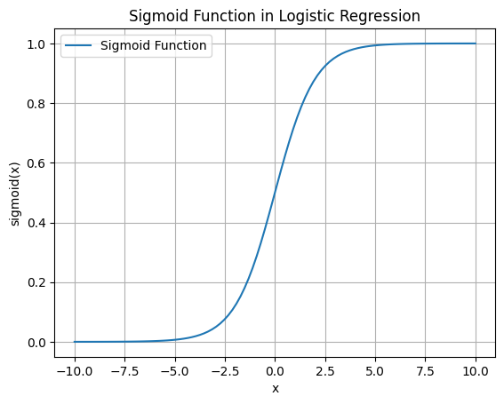
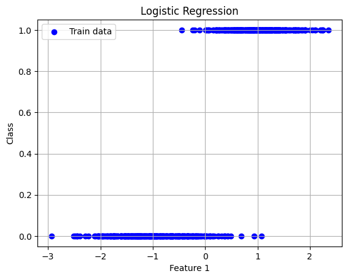
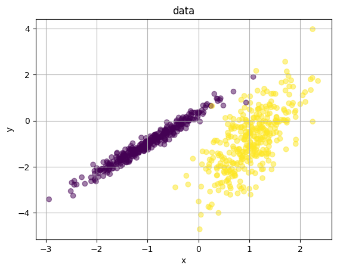
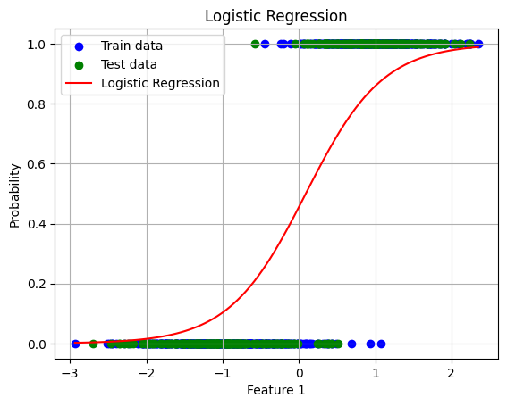
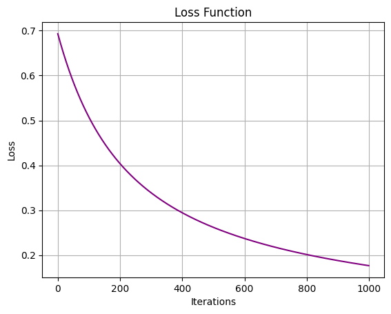
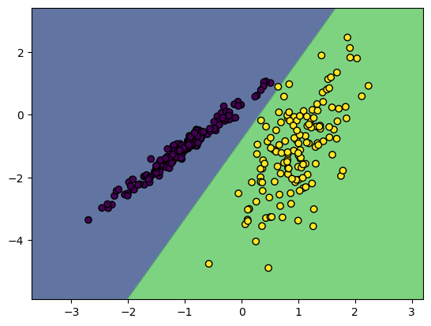

# 邏輯回歸 基本介紹

邏輯回歸（Logistic Regression）是一種用於分類問題的統計模型，特別適合處理二元分類問題（即目標變量只有兩個可能的取值，如0和1，或真和假）。儘管名稱中有“回歸”這個詞，邏輯回歸其實是一種分類方法。

以下是邏輯回歸的主要特點和原理：

### 1. 基本概念
邏輯回歸模型通過學習輸入特徵與目標變量之間的關係，預測目標變量的概率。假設我們有一個二元分類問題，其中目標變量 $Y$ 可以取0或1兩個值。我們希望根據輸入特徵 $X = (X_1, X_2, \ldots, X_n)$ 預測 $Y$ 的值。

### 2. 轉換函數
邏輯回歸使用邏輯函數（Logistic Function）或稱為S型函數（Sigmoid Function）將線性回歸的輸出轉換為概率值。邏輯函數的數學表達式為：
$\sigma(z) = \frac{1}{1 + e^{-z}}$
其中， $z = \beta_0 + \beta_1 X_1 + \beta_2 X_2 + \ldots + \beta_n X_n$ 是線性組合， $\beta_i$ 是模型的參數。

### 3. 預測概率
通過邏輯函數，我們可以將線性組合轉換為目標變量為1的概率：
$P(Y = 1|X) = \sigma(\beta_0 + \beta_1 X_1 + \beta_2 X_2 + \ldots + \beta_n X_n)$
對於二元分類問題，這個概率可以幫助我們決定最終的分類結果。例如，如果概率大於0.5，我們可以預測 $Y = 1$ ；否則，預測 $Y = 0$ 。

### 4. 模型訓練
邏輯回歸模型的參數 $\beta_i$ 通過最大似然估計（Maximum Likelihood Estimation, MLE）來估計。這涉及到最大化目標變量實際觀察值的概率，從而找到最優的參數集。

### 5. 性能評估
邏輯回歸模型的性能通常通過混淆矩陣（Confusion Matrix）、精度（Accuracy）、召回率（Recall）、F1分數（F1 Score）等指標來評估。這些指標能夠幫助我們了解模型在分類任務中的表現。

### 6. 多元分類擴展
邏輯回歸還可以擴展到處理多元分類問題，稱為多項式邏輯回歸（Multinomial Logistic Regression）或softmax回歸。在這種情況下，我們使用softmax函數來將線性組合轉換為多個類別的概率。

總結來說，邏輯回歸是一種簡單而有效的分類算法，廣泛應用於各種領域，如醫學診斷、信用評估和市場營銷等。它的優點包括易於解釋、計算效率高和對線性可分問題有良好表現。


```python
import torch
import torch.nn as nn
import numpy as np
import matplotlib.pyplot as plt

def sigmoid(x):
    return 1 / (1 + torch.exp(-x))

# 生成範圍在-10到10之間的數據點
x = torch.linspace(-10, 10, 100)
y = sigmoid(x)

# 繪製S形曲線
plt.plot(x.numpy(), y.numpy(), label="Sigmoid Function")
plt.title("Sigmoid Function in Logistic Regression")
plt.xlabel("x")
plt.ylabel("sigmoid(x)")
plt.legend()
plt.grid()
plt.show()

```


    

    


# 邏輯回歸在統計學上的意義主要體現在以下幾個方面：

### 1. 機率建模
邏輯回歸模型能夠將輸入變量映射到一個概率值，這使得它非常適合用於處理二元分類問題。通過預測某事件發生的概率，邏輯回歸能夠為決策提供量化依據。例如，在醫學中，可以預測一個病人患某種疾病的概率，從而幫助醫生制定治療方案。

### 2. 解釋性
邏輯回歸模型中的參數（$\beta$值）具有明確的解釋意義。每個參數表示對應輸入變量對預測結果的影響。具體來說，某個變量的係數越大，該變量對目標變量的影響就越顯著。這使得邏輯回歸在變量選擇和解釋方面具有優勢。

### 3. 假設檢驗
邏輯回歸提供了進行假設檢驗的框架，可以用來檢驗變量之間的關聯性。例如，可以使用似然比檢驗（Likelihood Ratio Test）、沃爾德檢驗（Wald Test）和斯科爾檢驗（Score Test）來檢驗各個參數的顯著性。這些檢驗能夠幫助研究者判斷哪些變量對模型具有顯著影響。

### 4. 順序數據和分類數據分析
邏輯回歸模型可以擴展到處理順序數據和多類別數據。例如，順序邏輯回歸（Ordinal Logistic Regression）和多項式邏輯回歸（Multinomial Logistic Regression）分別用於處理順序變量和多類別變量，這些模型在市場調查和社會科學研究中有廣泛應用。

### 5. 應用廣泛
邏輯回歸在多個領域中都有應用，如醫學診斷、金融風險評估、社會科學研究和市場營銷。在這些領域，邏輯回歸模型幫助分析師和決策者理解數據中的模式，並做出有根據的決策。

### 6. 多變量分析
邏輯回歸能夠處理多個自變量，這使得它可以分析多變量之間的交互作用。這種能力在探索複雜系統中的變量關係時尤其重要，如在生物醫學研究中分析基因和環境因素對疾病的影響。

### 7. 處理不平衡數據
邏輯回歸可以通過調整決策閾值和引入權重來處理不平衡數據集。這在許多實際應用中非常重要，例如在欺詐檢測和稀有事件預測中。

總結來說，邏輯回歸在統計學上具有重要意義，提供了處理分類問題的有效工具，具有良好的解釋性和靈活性，並且廣泛應用於各種領域。

# 為什麼邏輯回歸適合用MLE 不是MSE

### 機率分佈的考量

邏輯回歸假設目標變量服從伯努利分佈，這與最大似然估計（MLE, Maximum Likelihood Estimation）的原理相一致。均方誤差（MSE, Mean Squared Error）適用於高斯分佈的數據，而邏輯回歸中的二元變量顯然不符合這一假設。因此，使用最大似然估計能夠更準確地捕捉二元變量的分佈特性。

### 最大似然估計（Maximum Likelihood Estimation, MLE）是一種統計方法，用於估計模型參數，使得在給定觀測數據下，模型生成這些數據的可能性（即似然函數）最大化。換句話說，MLE 試圖找到參數值，使得觀測到的數據最有可能出現。

### MLE 的數學定義

假設我們有一組觀測數據 $\{x_1, x_2, \ldots, x_n\}$，這些數據由某個參數為 $\theta$ 的概率分布生成。似然函數 $L(\theta)$ 定義為在參數 $\theta$ 下觀測數據的聯合概率密度函數：

$L(\theta) = P(x_1, x_2, \ldots, x_n | \theta) = \prod_{i=1}^{n} P(x_i | \theta)$

其中，$P(x_i | \theta)$ 是在參數 $\theta$ 下，數據 $x_i$ 的概率。

MLE 試圖找到參數 $\theta$ 的估計值 $\hat{\theta}$，使得似然函數 $L(\theta)$ 最大化：

$\hat{\theta} = \arg \max_{\theta} L(\theta)$

由於對數函數是單調遞增的，為了簡化計算，我們通常最大化對數似然函數（Log-Likelihood Function），即：

$\ell(\theta) = \log L(\theta) = \sum_{i=1}^{n} \log P(x_i | \theta)$

因此，MLE 的估計值 $\hat{\theta}$ 也可以表示為：

$\hat{\theta} = \arg \max_{\theta} \ell(\theta)$

### 在邏輯回歸中的應用

在邏輯回歸中，我們假設輸出變量 $y$ 服從伯努利分布，其概率由輸入特征 $X$ 的線性組合通過 Sigmoid 函數轉換而來：

$P(y = 1 | X, \theta) = \sigma(X \cdot \theta) = \frac{1}{1 + e^{-(X \cdot \theta)}}$

這里，$\theta$ 是我們需要估計的參數，包括權重和偏置。

對於給定的訓練數據集 $\{(X_i, y_i)\}$，邏輯回歸模型的似然函數為：

$L(\theta) = \prod_{i=1}^{m} P(y_i | X_i, \theta) = \prod_{i=1}^{m} \sigma(X_i \cdot \theta)^{y_i} (1 - \sigma(X_i \cdot \theta))^{1 - y_i}$

其對數似然函數為：

$$\ell(\theta) = \sum_{i=1}^{m} \left[ y_i \log(\sigma(X_i \cdot \theta)) + (1 - y_i) \log(1 - \sigma(X_i \cdot \theta)) \right]$$

為了最大化對數似然函數，我們可以使用梯度下降法，通過叠代更新參數 $\theta$ 來找到使對數似然函數最大化的參數值。

在梯度下降中，參數更新公式為：

$\theta \leftarrow \theta + \alpha \frac{\partial \ell(\theta)}{\partial \theta}$

這里，$\alpha$ 是學習率，$\frac{\partial \ell(\theta)}{\partial \theta}$ 是對數似然函數對參數 $\theta$ 的梯度。

# 版本一 手刻一個MLE的邏輯回歸

### 生成簡單的二元分類數據集


```python
import numpy as np
import matplotlib.pyplot as plt
from sklearn.datasets import make_classification
from sklearn.model_selection import train_test_split

# 生成二元分類數據集
X, y = make_classification(n_samples=1000, n_features=2, n_informative=2, n_redundant=0, n_clusters_per_class=1, random_state=4)

# 分割數據集為訓練集和測試集
X_train, X_test, y_train, y_test = train_test_split(X, y, test_size=0.3, random_state=42)

# 繪製數據點（選擇第一個特徵）
plt.scatter(X_train[:, 0], y_train, color='blue', label='Train data')

# 添加標題和標籤
plt.title('Logistic Regression')
plt.xlabel('Feature 1')
plt.ylabel('Class')
plt.legend()
plt.grid()
plt.show()

plt.scatter(X_train[:, 0], X_train[:, 1], c = y_train,alpha = 0.5)
# 添加標題和標籤
plt.title('data')
plt.xlabel('x')
plt.ylabel('y')
plt.grid()
plt.show()

```


    

    


    

    


## 定義Sigmoid函數


```python
def sigmoid(z):
    return 1 / (1 + np.exp(-z))

```

### 步驟 5：定義邏輯回歸模型和似然函數

伯努利分布的概率質量函數，表示隨機變量 $ X $ 取值為 $ x $ 的概率。公式如下：

$ f_{X}(x) = p^{x}(1-p)^{1-x} = \left\{ \begin{matrix} p & \text{if } x = 1, \\ 1-p & \text{if } x = 0. \end{matrix} \right. $

在這個公式中：
- $ x $ 是隨機變量 $ X $ 的取值，且 $ x $ 只能取0或1。具體來說：
  - $ x = 1 $ 時，表示事件發生的概率為 $ p $。
  - $ x = 0 $ 時，表示事件不發生的概率為 $ 1-p $。

### 伯努利分布解釋

伯努利分布用於描述只有兩個可能結果（通常稱為 "成功" 和 "失敗" 或 1 和 0）的隨機事件。其概率質量函數定義如下：

$ P(X = x) = \left\{ \begin{matrix} p & \text{if } x = 1, \\ 1-p & \text{if } x = 0. \end{matrix} \right. $

- $ p $ 是事件成功（即 $ X = 1 $）的概率。
- $ 1-p $ 是事件失敗（即 $ X = 0 $）的概率。

### 在邏輯回歸中的應用
在邏輯回歸中，給定模型參數 $\mathbf{W}$
和 $\mathbf{b}$，樣本 $i$ 的預測概率為：
$ \hat{y}_i = \sigma(\hat{\mathbf{W}} \cdot \hat{\mathbf{X}_i} + \hat{b}) = \frac{1}{1 + e^{-(\hat{\mathbf{W}} \cdot \hat{\mathbf{X}_i} + \hat{b})}} $

這裡，$\sigma(z)$ 是 Sigmoid 函數。

負對數似然損失函數（Negative Log-Likelihood Loss）可以表示為：
$ L(\mathbf{W}, b) = -\frac{1}{m} \sum_{i=1}^m \left[ y_i \log(\hat{y}_i) + (1 - y_i) \log(1 - \hat{y}_i) \right] $

其中：
- $m$ 是樣本數
- $y_i$ 是真實標籤
- $\hat{y}_i$ 是模型預測的概率

這個公式表示對於所有樣本，我們計算每個樣本的預測概率與實際標籤之間的差異，並取對數，再求和取負值。這樣的損失函數在梯度下降過程中被最小化，以更新模型的參數 $\mathbf{W}$ 和 $\mathbf{b}$。

在代碼中，這段損失函數的實現如下：
```python
# 計算損失 (負對數似然損失)
loss = - (1 / self.m) * np.sum(self.y * np.log(y_pred) + (1 - self.y) * np.log(1 - y_pred))
```

這裡的 `self.y` 是真實標籤，`y_pred` 是預測的概率，`self.m` 是樣本數。

### 更新權重的數學公式

對於權重 $\mathbf{W}$ 和偏置 $b$，我們使用梯度下降來更新它們。具體的更新公式如下：
$ \mathbf{W} \leftarrow \mathbf{W} - \alpha \frac{\partial L}{\partial \mathbf{W}} $
$ b \leftarrow b - \alpha \frac{\partial L}{\partial b} $

其中：
- $\alpha$ 是學習率
- $\frac{\partial L}{\partial \mathbf{W}}$ 和 $\frac{\partial L}{\partial b}$ 是損失函數對權重和偏置的梯度

這些梯度的計算公式為：
$ \frac{\partial L}{\partial \mathbf{W}} = \frac{1}{m} \sum_{i=1}^m (\hat{y}_i - y_i) \mathbf{X}_i $
$ \frac{\partial L}{\partial b} = \frac{1}{m} \sum_{i=1}^m (\hat{y}_i - y_i) $

這些公式在代碼中被實現如下：
```python
# 計算梯度
dw = (1 / self.m) * np.dot(self.X.T, (y_pred - self.y))
db = (1 / self.m) * np.sum(y_pred - self.y)
```


```python
class LogisticRegression:
    def __init__(self, learning_rate=0.01, num_iterations=1000):
        self.learning_rate = learning_rate
        self.num_iterations = num_iterations

    def fit(self, X, y):
        self.m, self.n = X.shape
        self.W = np.zeros(self.n)
        self.b = 0
        self.X = X
        self.y = y

        self.losses = []
        for i in range(self.num_iterations):
            loss = self.update_weights()
            self.losses.append(loss)
            if (i+1) % 100 == 0:
                print(f'Epoch [{i+1}/{self.num_iterations}], Loss: {loss:.4f}')

    def update_weights(self):
        # 預測
        linear_model = np.dot(self.X, self.W) + self.b
        y_pred = sigmoid(linear_model)

        # 計算損失 (負對數似然損失)
        loss = - (1 / self.m) * np.sum(self.y * np.log(y_pred) + (1 - self.y) * np.log(1 - y_pred))

        # 計算梯度
        dw = (1 / self.m) * np.dot(self.X.T, (y_pred - self.y))
        db = (1 / self.m) * np.sum(y_pred - self.y)

        # 更新權重
        self.W -= self.learning_rate * dw
        self.b -= self.learning_rate * db

        return loss

    def predict(self, X):
        linear_model = np.dot(X, self.W) + self.b
        y_pred = sigmoid(linear_model)
        y_pred_class = [1 if i > 0.5 else 0 for i in y_pred]
        return np.array(y_pred_class)
```


```python
model = LogisticRegression(learning_rate=0.01, num_iterations=1000)
model.fit(X_train, y_train)

```

    Epoch [100/1000], Loss: 0.5086
    Epoch [200/1000], Loss: 0.4044
    Epoch [300/1000], Loss: 0.3392
    Epoch [400/1000], Loss: 0.2945
    Epoch [500/1000], Loss: 0.2620
    Epoch [600/1000], Loss: 0.2371
    Epoch [700/1000], Loss: 0.2173
    Epoch [800/1000], Loss: 0.2012
    Epoch [900/1000], Loss: 0.1878
    Epoch [1000/1000], Loss: 0.1764
    


```python
y_pred = model.predict(X_test)
accuracy = np.mean(y_pred == y_test)
print(f'Accuracy: {accuracy * 100:.2f}%')

```

    Accuracy: 97.67%
    


```python
# 繪製數據點
plt.scatter(X_train[:, 0], y_train, color='blue', label='Train data')
plt.scatter(X_test[:, 0], y_test, color='green', label='Test data')

# 繪製邏輯回歸曲線
x_values = np.linspace(min(X[:, 0]), max(X[:, 0]), 100)
y_values = sigmoid(model.W[0] * x_values + model.b)
plt.plot(x_values, y_values, color='red', label='Logistic Regression')

# 添加標題和標籤
plt.title('Logistic Regression')
plt.xlabel('Feature 1')
plt.ylabel('Probability')
plt.legend()
plt.grid()
plt.show()

# 繪製損失函數曲線
plt.plot(range(model.num_iterations), model.losses, color='purple')
plt.title('Loss Function')
plt.xlabel('Iterations')
plt.ylabel('Loss')
plt.grid()
plt.show()

```


    

    


    

    


# torch 版本


```python
import torch
import torch.nn as nn
import torch.optim as optim
import numpy as np
import matplotlib.pyplot as plt
from sklearn.datasets import make_classification
from sklearn.model_selection import train_test_split
from torch.utils.data import Dataset, DataLoader, TensorDataset

```


```python
# 生成二元分類數據集
X, y = make_classification(n_samples=1000, n_features=2, n_informative=2, n_redundant=0, n_clusters_per_class=1, random_state=4)

# 分割數據集為訓練集和測試集
X_train, X_test, y_train, y_test = train_test_split(X, y, test_size=0.3, random_state=42)

# 將數據轉換為torch張量
X_train = torch.tensor(X_train, dtype=torch.float32)
y_train = torch.tensor(y_train, dtype=torch.float32).view(-1, 1)
X_test = torch.tensor(X_test, dtype=torch.float32)
y_test = torch.tensor(y_test, dtype=torch.float32).view(-1, 1)

# 檢查是否有可用的 GPU
device = torch.device("cuda" if torch.cuda.is_available() else "cpu")

train_dataset = TensorDataset(X_train.to(device),y_train.to(device))
test_dataset = TensorDataset(X_test.to(device),y_test.to(device))

# 創建 DataLoader
train_loader = DataLoader(train_dataset, batch_size=40, shuffle=True)
test_loader = DataLoader(test_dataset, batch_size=40, shuffle=False)

```


```python
dim = X_train.shape[1]
```


```python
class LogisticRegressionModel(nn.Module):
    def __init__(self,dim):
        super(LogisticRegressionModel,self).__init__()
        self.h1 = nn.Linear(dim, 1)
    def forward(self,x):
        x = torch.sigmoid(self.h1(x))
        return x
```


```python
from torchinfo import summary
model = LogisticRegressionModel(dim).to(device)
summary(model, input_size=(1, 2))
```


    ==========================================================================================
    Layer (type:depth-idx)                   Output Shape              Param #
    ==========================================================================================
    LogisticRegressionModel                  [1, 1]                    --
    ├─Linear: 1-1                            [1, 1]                    3
    ==========================================================================================
    Total params: 3
    Trainable params: 3
    Non-trainable params: 0
    Total mult-adds (M): 0.00
    ==========================================================================================
    Input size (MB): 0.00
    Forward/backward pass size (MB): 0.00
    Params size (MB): 0.00
    Estimated Total Size (MB): 0.00
    ==========================================================================================


```python
# 定義損失函數和優化器
criterion = nn.BCELoss()
optimizer = optim.Adam(model.parameters(), lr=0.01)

# 基本訓練結構

# 訓練模型
epochs = 100
for epoch in range(epochs):
    model.train()
    for xb, yb in train_loader:
        xb, yb = xb.to(device), yb.to(device)  # 確保數據在正確的設備上
        optimizer.zero_grad()
        y_pred = model(xb)
        loss = criterion(y_pred, yb)
        loss.backward()
        optimizer.step()
    if (epoch + 1) % 10 == 0:
        print(f'Epoch {epoch + 1}/{epochs}, Loss: {loss.item()}')
```

    Epoch 10/100, Loss: 0.18940748274326324
    Epoch 20/100, Loss: 0.1307355910539627
    Epoch 30/100, Loss: 0.10745090246200562
    Epoch 40/100, Loss: 0.04122437909245491
    Epoch 50/100, Loss: 0.15822254121303558
    Epoch 60/100, Loss: 0.04722483828663826
    Epoch 70/100, Loss: 0.040391188114881516
    Epoch 80/100, Loss: 0.02331869676709175
    Epoch 90/100, Loss: 0.057248424738645554
    Epoch 100/100, Loss: 0.035281047224998474
    


```python
# 測試模型
model.eval()
with torch.no_grad():
    correct = 0
    total = 0
    for xb, yb in test_loader:
        xb, yb = xb.to(device), yb.to(device)
        y_pred = model(xb)
        predicted = (y_pred > 0.5).float()
        total += yb.size(0)
        correct += (predicted == yb).sum().item()

    accuracy = correct / total
    print(f'Accuracy: {accuracy * 100:.2f}%')
```

    Accuracy: 99.67%
    


```python
# 可視化結果
def plot_decision_boundary(model, X, y):
    x_min, x_max = X[:, 0].min() - 1, X[:, 0].max() + 1
    y_min, y_max = X[:, 1].min() - 1, X[:, 1].max() + 1
    xx, yy = np.meshgrid(np.arange(x_min, x_max, 0.1),
                         np.arange(y_min, y_max, 0.1))
    grid = torch.tensor(np.c_[xx.ravel(), yy.ravel()], dtype=torch.float32).to(device)
    with torch.no_grad():
        probs = model(grid).reshape(xx.shape).cpu().numpy()
    plt.contourf(xx, yy, probs, alpha=0.8, levels=[0, 0.5, 1])
    plt.scatter(X[:, 0], X[:, 1], c=y, edgecolors='k', marker='o')
    plt.show()

plot_decision_boundary(model, X_test.cpu().numpy(), y_test.cpu().numpy())
```


    

    


```python

```
